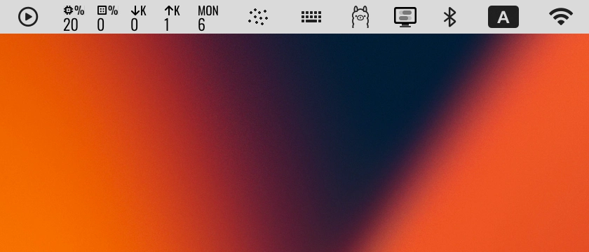

# Stat


Tiny menu bar app that shows CPU, GPU, network speed, and weekday at a glance.



## Install

```sh
/bin/bash -c "$(curl -fsSL https://raw.githubusercontent.com/vladstudio/mac-stat/main/install.sh)"
```

- Verifies macOS 15+ on Apple Silicon
- Downloads the latest release from GitHub
- Installs to `/Applications` (replaces existing version)
- Opens the app

## License

MIT
